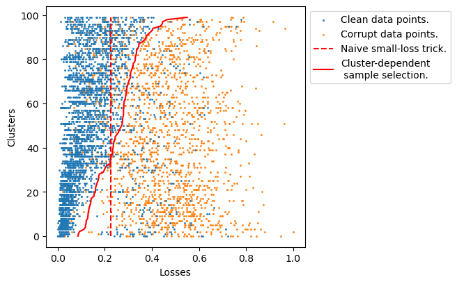
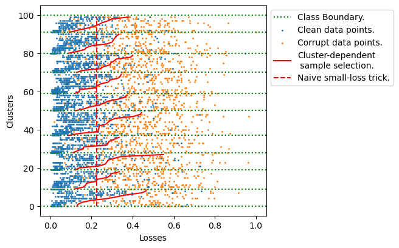

## Temporary anonymous repository for reviewers

- The repo is a temporary anonymous place, providing code and supplementary experiments for rebuttal.
- Complete repository would be made public if the paper is accepted.
- Related experimental codes are placed in [code](https://github.com/AnonymousForICASSP2024/TemporaryAnonymousRepForReviewers/tree/master/code).
- The paper with additional experiments are placed in [paper](https://github.com/AnonymousForICASSP2024/TemporaryAnonymousRepForReviewers/blob/master/docs/paper.pdf).

## Responses to the reviewers' comments

- In this section, we would focus on the concerns of the reviewers.

### Experimental results using larger and realistic datasets.

- table: Experimental results for Clothing1M, (mini) WebVision, and ILSVRC12 datasets.
Clothing1M-I: Training with all 1 million samples of Clothing1M. 
Clothing1M-II: Training with randomly selected 5000 samples.
The test accuracy (\%) is evaluated on Clothing1M validation set, WebVision validation set, and ILSVRC12 validation set respectively.

| **Methods**         | **Clothing1M-I** | **Clothing1M-II** | **WebVision** | **ILSVRC12** |
|----------------------|------------------|-------------------|---------------|--------------|
| CE (Standard)        | 69.55            | 45.11             | -             | -            |
| T-Revision           | 74.18           | 40.32             | -             | -            |
| PTD                  | 71.67           | 25.33             | -             | -            |
| ELR+                 | 74.81      | *60.67*           | 77.78    | 70.29   |
| DivideMix            | 74.76       | 56.57             | 77.32   | 75.20  |
| ProMix               | 72.85            | 55.39             | 75.73         | 74.96        |
| SOP                  | 73.50      | 48.78             | 76.60     | 69.10    |
| ClusterMix (ours)   | 74.84            | 61.98        | 78.19     | 75.54    |

We evaluate the proposed method on three larger datasets, i.e. Clothing1M with 1 million samples, WebVision with 2.4 million images, and ILSVRC12 with approximately 66 thousand images.
Experimental results illustrates the effectiveness of the proposed method on larger datasets.

### Experimental results compared with SOTA self-supervised method.

- Table: Experiments on CIFAR-10 dataset (50000 training samples) with symmetric label noise. 

| ACC(%) |     T-Revision    |     DivideMix    |     ClusterMix    |     ClusterMix (Given clean data)    |     SPICE (self-supervised)   |
|:---:|:---:|:---:|:---:|:---:|:---:|
|     20% Noise    |     88.10    |     95.97    |     96.35    |     96.52    |     92.26    |
|     40% Noise    |     84.11    |     94.82    |     95.50    |     95.83    |     92.26    |
| 60% Noise | 71.18 | 93.07 | 94.34 | 94.71 |     92.26    |
|     80% Noise    |     60.32    |     91.15    |     91.54    |     91.97    |     92.26    |

Experimental results illustrates the effectiveness of the proposed method, except the extremely high noise rate.

### Experimental results with different network structures.

Below are the experimental results obtained with both ResNet and ViT architectures. The experiments illustrate that the proposed method exhibits easy generalization to both ResNet and ViT backbones, yielding comparable performance.

Table: Test accuracy (%) on CIFAR-10 dataset with synthetic symmetric and asymmetric label noise.

| Backbone        | Sym. $20\%$ | Sym. $40\%$ | Sym. $60\%$ | Sym. $80\%$ | Sym. $90\%$ | Asy. (40\%) |
|------------------|-------------|-------------|-------------|-------------|-------------|-------------|
| ResNet-18        | 95.78       | 95.21       | 94.95       | 90.87       | 74.49       | 92.06       |
| ResNet-34        | 96.35       | 95.50       | 95.36       | 91.54       | 77.94       | 92.63       |
| ResNet-50        | 96.39       | 95.62       | 95.33       | 91.47       | 76.26       | 92.74       |
| ViT-base         | 94.89       | 94.51       | 94.23       | 90.14       | 75.38       | 91.96       |

### Experimental results with different number of clusters and clustering methods.

More intermediate number of clusters are shown in following table. Both the test accuracy and training time increase with the increase of the number of clusters $K$, except $K>800$.

- Table: Test accuracy (\%) and training time (h) with different number of clusters.
The experiments are conducted on CIFAR-10N Worst dataset with 5000 training samples.

| **Clusters $K$** | 1     | 5     | 10    | 50    | 100   | 200   | 500   | 800   | 1000  |
|--------------------|-------|-------|-------|-------|-------|-------|-------|-------|-------|
| **Accuracy**       | 69.78 | 70.35 | 71.02 | 72.85 | 73.30 | 74.27 | 75.26 | 76.03 | 74.37 |
| **Training time**  | 2.2h  | 2.3h  | 2.4h  | 2.6h  | 2.7h  | 3.0h  | 4.5h  | 5.0h  | 5.5h  |

Second, we analyse the sensitivity for the choices of different clustering methods. The experiment results demonstrate that our method achieves similar test accuracy and training time among different clustering algorithms, except DBSCAN.

- Table: Test accuracy (\%) and training time (h) with different clustering methods.
The experiments are conducted on CIFAR-10N Worst dataset with 5000 training samples.

| **Methods**               | K-Means | K-Means++ | Hierarchical clustering | DBSCAN |
|---------------------------|---------|-----------|--------------------------|--------|
| **Accuracy**              | 74.27   | 74.10     | 74.25                    | 70.84  |
| **Training time**         | 3h      | 3h        | 3h                       | 2.5h   |

### Validity analysis of the proposed method. 

Comparison of the proposed cluster-dependent sample selection strategy and the naive sample selection.
The red lines are the decision lines for the clean sample selection, i.e. The samples on the left of the lines will be selected as clean samples in the algorithms.

- Figure a: Clusters are sorted by the selection criteria.

- Figure b: Clusters are first grouped by the main classes and then sorted by the selection criteria.

The above figures illustrates the effectiveness of the proposed cluster-dependent sample selection strategy.
In the process of the small-loss samples selection, the proposed method adds another dimension and thus have variable criteria for different clusters. The proposed method can select more precise and adequate clean samples and thus achieve better evaluation accuracy.
Besides, Figure b also shows the variability of the noise distribution inside each class.